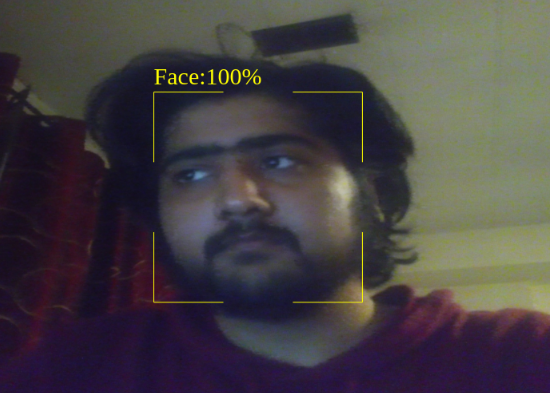

# Super-Resolution-of-Human-Faces
In this project, we have ported the Fast Super-Resolution CNN (FSRCNN) model to the Atlas 200 DK and run it on the faces taken from the Face Detection model. One of the potential applications for this would be to deplo FSRCNN on a smartphone and inference an input image with faces to scale in size with minimal data loss.

# Faster Super Resolution CNN
Faster Super Resolution CNN is an evolved CNN from SRCNN. While SRCNN does a good job of bringing out scaled images, due to the operations such as Bicubic interpolation and
the non-linear mapping of image features, it is not fast enough to be used in real-time. This resulted in an evaluation speed of 1.6 frames per second, which is not ideal for
real-time conversion. The FSRCNN handles it with few changes to the original architecture and it was able to achieve 24 frames per second. The main modifications are the removal of bicubic interpolation and further, for a speed up, the number of features for non-linear mapping was drastically reduced by the shrinking phase and further expanded again to keep the performance fairly equivalent to the original architecture. Due to these small factors, a good amount of speed up was observed. This is why we will be using FSRCNN as our model for super-resolution.

# Model Conversion
Da Vinci architecture is the format in which the model has to be used in the Ascend 310 chip. There are two ways to configure the generated model. We can use the MindStudio GUI or we can also make use of the OMG command-line interface which offers more flexible conversion whereas the GUI is restricted on many levels.

# Face Detection using Atlas 200 DK
Atlas 200 AI Developer Kit is powered by Ascend 310 processor, helps AI application developers to deploy pre-trained models, and use the powerful processing capability of
Ascend 310 processors to test real-time applications. The Atlas 200 DK uses its external camera as the input video data in real-time to detect faces in video images and display face detection results using a presenter server.
# Results
This image is the output obtained from the Face Detection Model built on Atlas 200 DK: 
  
 
 This image is the final output obtained from the Da Vinci Model after integrating FSRCNN onto Atlas 200 DK:
  
# REFERENCES
* Chao Dong, Chen Change Loy, Xiaoou Tang. Accelerating the Super-Resolution Convolutional Neural Network, in Proceedings of European Conference on Computer Vision (ECCV), 2016
* https://github.com/Saafke/FSRCNN_Tensorflow
* https://towardsdatascience.com/review-fsrcnn-super-resolution-80ca2ee14da4
* https://www.huaweicloud.com/intl/en-us/ascend/doc/Atlas200DK/1.3.0.0/en/en-us_topic_0173402133.html
* https://www.huaweicloud.com/intl/en-us/ascend/doc/Atlas200DK/1.3.0.0/en/en-us_topic_0165968579.html

