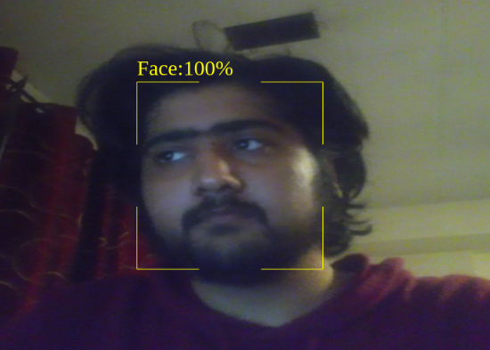

# Super-Resolution-of-Human-Faces
This project demonstrates the integration of the Fast Super-Resolution Convolutional Neural Network (FSRCNN) model onto the Atlas 200 DK platform for real-time facial image enhancement. Combining real-time face detection with efficient image upscaling, the system showcases the potential of deploying advanced AI models on edge devices for low-latency, high-quality visual enhancement.

## ⚙️ What is FSRCNN?
The Fast Super-Resolution CNN (FSRCNN) is a real-time super-resolution model that builds upon and optimizes the earlier SRCNN architecture.
| Feature | SRCNN | FSRCNN |
| --- | --- | --- | 
| Upsampling Technique | Bicubic interpolation | Learnable deconvolution |
| Inference Speed | ~1.6 FPS | ~24 FPS |
| Application | Offline (slow) | Real-time, edge-ready |

Key Enhancements in FSRCNN:

- Replaces slow bicubic interpolation with efficient deconvolution layers

- Reduces model complexity and improves speed significantly

- Ideal for real-time applications with constrained hardware (e.g., Atlas 200 DK)

## 🧱 System Architecture

## 🛠️ Model Conversion (to Da Vinci Format)
To run the FSRCNN model on the Ascend 310 chip, it must be converted to a compatible Da Vinci format.

### 🧩 Options:
- MindStudio GUI: User-friendly interface for model configuration and conversion

- OMG CLI (Offline Model Generator): Powerful command-line tool for advanced model optimization and deployment

> Note: CLI is recommended for greater customization and repeatability in automation pipelines.

# 🖥️ Face Detection on Atlas 200 DK
The Atlas 200 AI Developer Kit is powered by Huawei’s Ascend 310 processor and supports real-time AI inference. Features include:

- Direct camera input for live face detection

- Presenter server for web-based result visualization

- Support for deploying multiple models simultaneously for pipeline tasks

## 🧪 Results

### 🎯 Face Detection Output (Real-Time Inference):
Example image or frame showing successful face detection on live input.
 

### 📈 Super-Resolution Output (FSRCNN-enhanced on-device):
High-resolution output image showcasing improved facial clarity after FSRCNN processing.
   

 
# 📚 References
* [Dong, Chao, et al. "Accelerating the Super-Resolution Convolutional Neural Network." (2016)](https://arxiv.org/abs/1608.00367)
* [FSRCNN TensorFlow Implementation (by Saafke)](https://github.com/Saafke/FSRCNN_Tensorflow)
* [FSRCNN Explained on Towards Data Science](https://towardsdatascience.com/review-fsrcnn-super-resolution-80ca2ee14da4)
* [Huawei Atlas 200 DK Documentation](https://www.huaweicloud.com/intl/en-us/ascend/doc/Atlas200DK/1.3.0.0/en/en-us_topic_0173402133.html)
* [Model Conversion Guide (Ascend)](https://www.huaweicloud.com/intl/en-us/ascend/doc/Atlas200DK/1.3.0.0/en/en-us_topic_0165968579.html)

